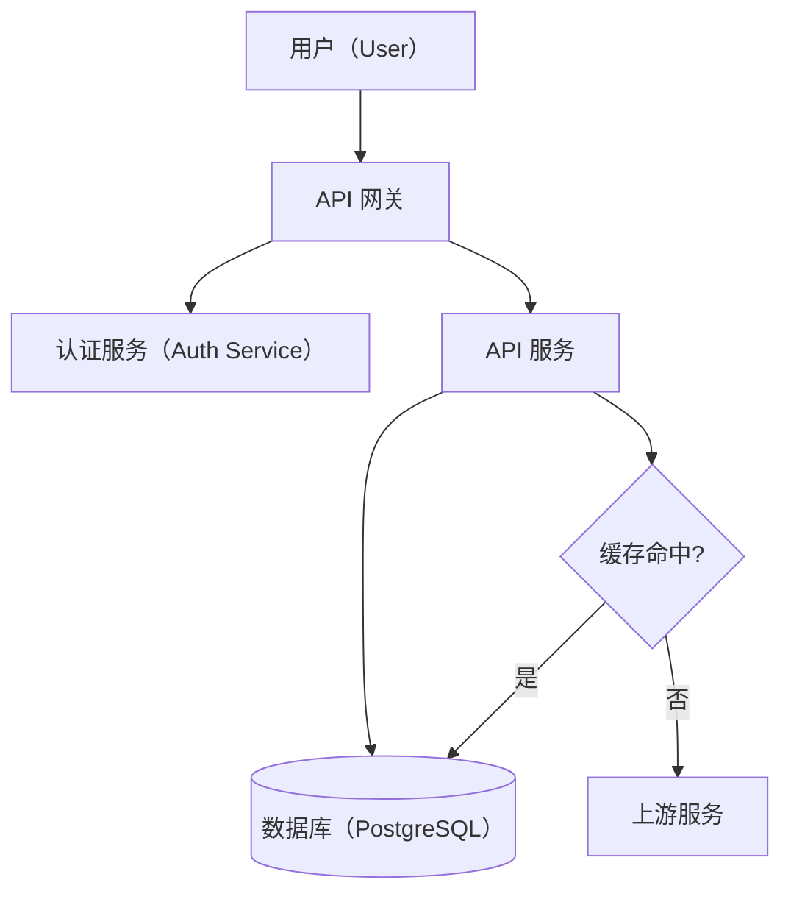
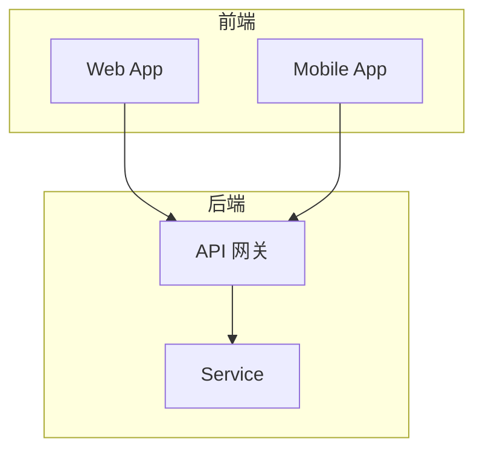
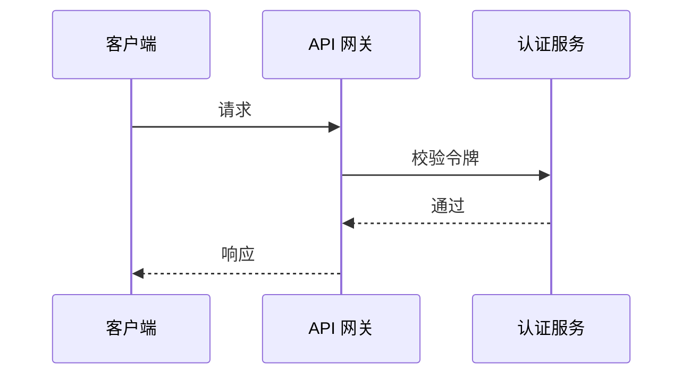
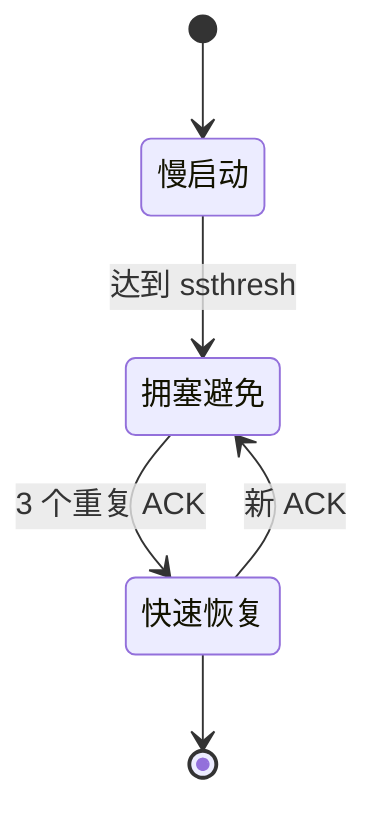

# Mermaid Diagram Conventions for Knowledge Notes

A diagram in a knowledge note compresses a structural or temporal relationship that prose would take paragraphs to convey. These conventions keep every diagram render-safe in both Obsidian themes, terminology-consistent with the note, and glanceable. A diagram that fails any of the three does not belong in the note (Phase 5's 5D removal test).

## Choose the diagram type by what you are showing

| The note is showing | Use |
|---|---|
| Architecture, layering, data flow, protocol flow | `flowchart` |
| Interaction order between components | `sequenceDiagram` |
| A system's states and the transitions between them | `stateDiagram-v2` |

`flowchart` is the modern keyword; `graph` is its legacy alias, kept only for backward compatibility. Always write `flowchart`.

## Render safely in both themes

Obsidian bundles Mermaid with the light theme and fakes dark mode by applying a CSS `invert()` filter to the rendered SVG. A hardcoded `fill:` / `stroke:` / `color:` reads correctly in one theme, but the other theme applies the `invert()` filter, so the same color lands wrong there. Rely on the theme's default Mermaid rendering — it adapts automatically.

## One concept per diagram

A reader takes in a diagram as a single unit. If it needs labels explaining what it shows, or you catch yourself mixing layers with message order, split it. Each diagram teaches exactly one relationship.

## Node shape carries the type, never color

- Rectangle — process or service (the default)
- Cylinder `[(…)]` — database or storage
- Diamond `{…}` — decision
- `subgraph` — a boundary or grouping, not a node

Shape alone must convey the role, because color is unreliable across themes.

## Labels follow the note's terminology (§2 of SKILL.md)

A diagram is part of the note, so its labels obey the same terminology rules as the body: gloss `中文（English）` on first mention when Chinese is what people say (branch 2), or use the English term as-is when that is the common usage (branch 3 — `API`, `RAG`). One difference: a wikilink inside a diagram block surfaces as literal text, not a resolved link, so branch 1's link-to-definition rule never applies — diagrams use branches 2/3 only, and a label must match the exact term the surrounding prose uses, never a fresh variant.

No emoji in labels. Emoji renders inconsistently across platforms and reads as icons, not identifiers.

## Examples

### Flowchart — architecture with a database

### Flowchart — grouping with subgraphs

### Sequence diagram — interaction order

### State diagram — states and transitions

