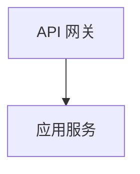
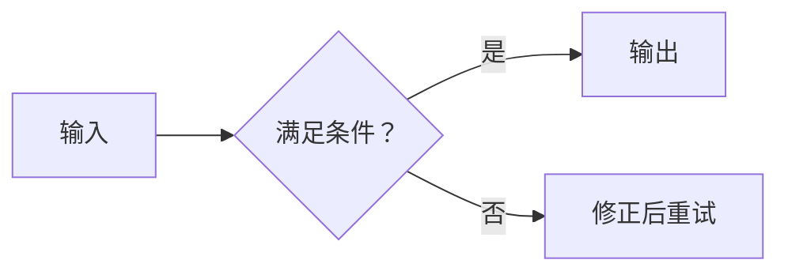
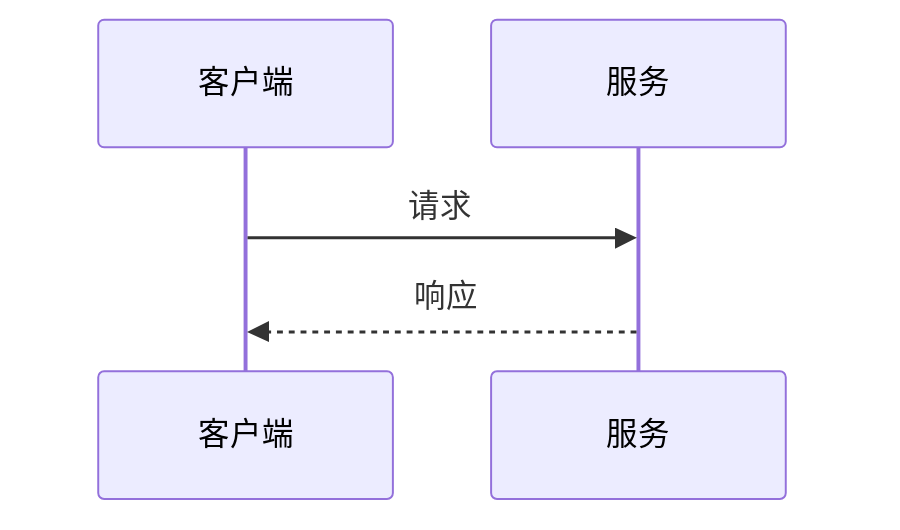
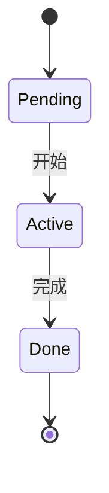
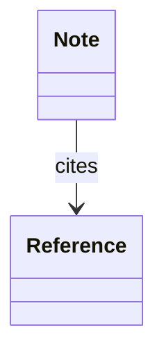
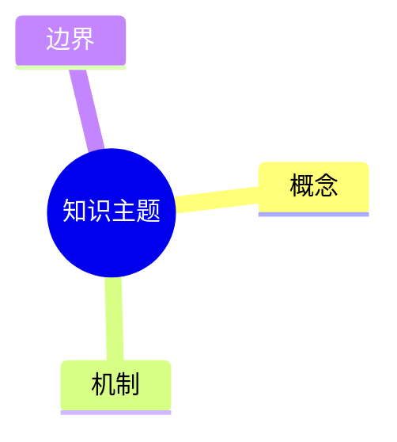
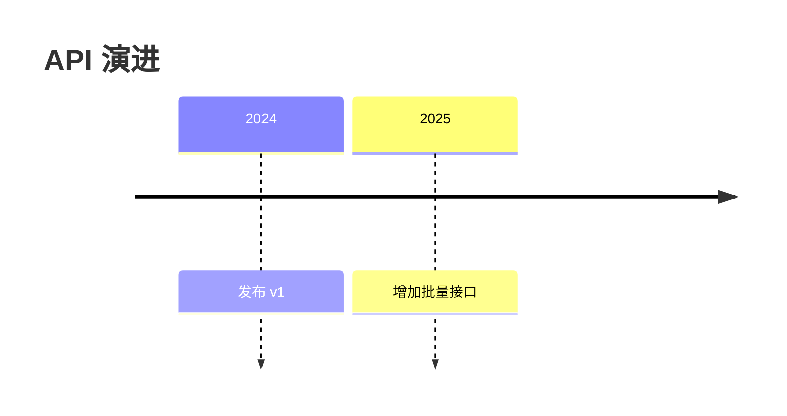
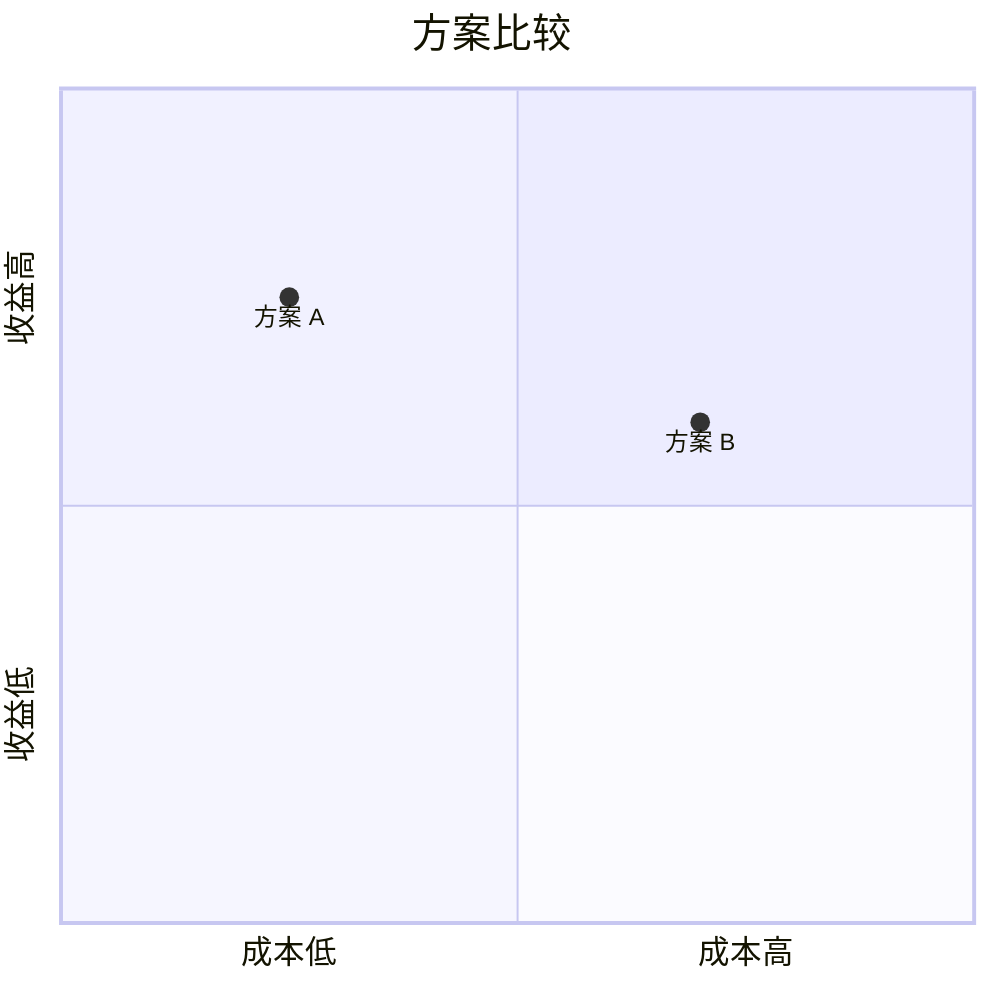
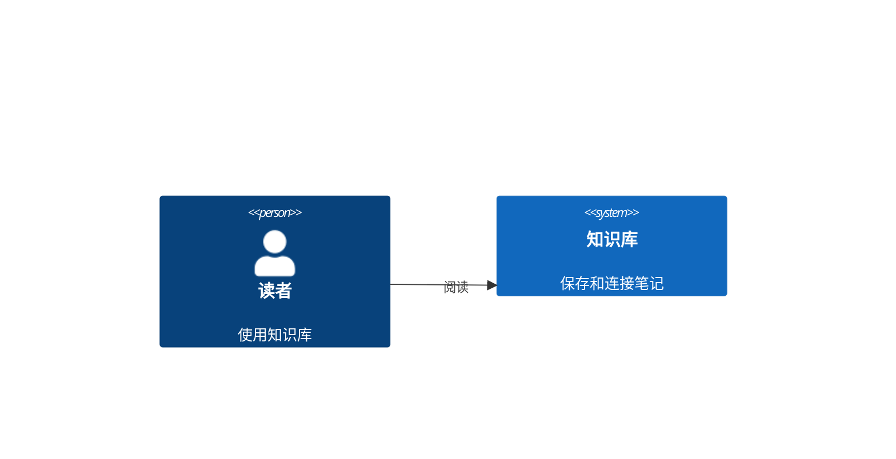
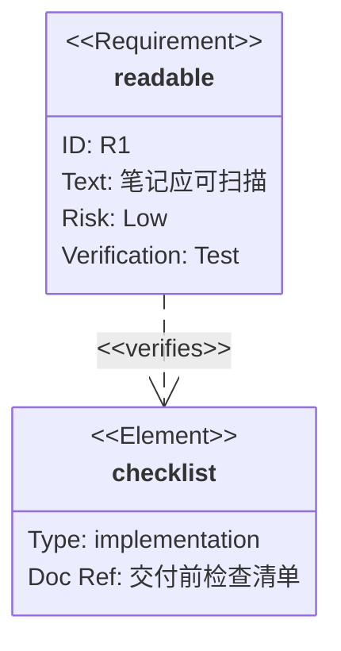

# Mermaid Reference for Knowledge Notes

本文件负责 Mermaid 的选型、语法约束、兼容性分层和渲染 fallback。`check-note-surface.ts` 只检查图类型声明、危险指令和少量已知语法风险；它不能证明图的因果关系正确、数据可信或已经在目标 Obsidian 版本中渲染成功。

只在图能压缩一个重要关系时使用它。若两三句话比图更清楚，就不要为了“有图”而画图。

## 1. 先按读者问题选类型

一个图只承担一个主要问题。下面的“常用”是长期知识笔记的默认选择；“进阶”适合问题本身要求这种表达；“专用”不是禁用，而是只有在它比通用图更精确时才使用。

注意：这里的层级表示教学适配，不是 renderer 兼容承诺。`常用` 只表示基础语法候选，仍需确认目标阅读视图；`进阶` 和 `专用` 默认未验证，状态定义见第 4 节。

| 层级 | 读者要回答的问题 | 类型 | 适合表达 | 不要拿它代替 |
| --- | --- | --- | --- | --- |
| 常用 | 有哪些组件、边界、步骤或数据路径？ | `flowchart`（`graph` 为兼容别名） | 架构、流程、因果链、决策和分层 | 时间轴、类模型 |
| 进阶 | 流程图规模较大，需要 ELK 布局吗？ | `flowchart-elk` | 更复杂流程的布局实验 | 仍可用普通 `flowchart` 表达的简单关系 |
| 进阶 | 谁负责每个步骤，交接发生在哪里？ | `swimlane-beta` | 按团队、角色、阶段划分的流程 | 没有所有权问题的普通流程 |
| 常用 | 谁先调用谁，期间发生了什么？ | `sequenceDiagram` | 请求/响应、协作、生命周期中的一次交互 | 静态组件关系 |
| 常用 | 对象有哪些状态，什么事件触发转移？ | `stateDiagram-v2`（旧版 `stateDiagram`） | 生命周期、协议状态、状态机 | 一次性的执行步骤 |
| 常用 | 哪些类型、接口和关系构成模型？ | `classDiagram`（兼容 `classDiagram-v2`） | 类、接口、继承、组合、依赖 | 运行时调用顺序 |
| 常用 | 哪些实体如何关联，基数是什么？ | `erDiagram` | 表、实体、字段关系、基数 | 面向对象继承 |
| 常用 | 一个主题如何拆成概念层级？ | `mindmap` | 知识树、分类、脑图 | 有方向的流程 |
| 常用 | 事件、版本或阶段如何沿时间展开？ | `timeline` | 历史、演进、里程碑、版本线 | 任务排期 |
| 常用 | 一组任务何时开始、结束、依赖什么？ | `gantt` | 计划、阶段、依赖和并行工作 | 概念流程或因果解释 |
| 常用 | 用户或角色在每一阶段体验如何？ | `journey` | 旅程步骤、体验分数、痛点 | 系统内部调用 |
| 常用 | 对象按两个明确维度如何分布？ | `quadrantChart` | 取舍、定位、风险/收益、优先级 | 没有量纲的主观排名 |
| 常用 | 总量由哪些部分组成？ | `pie` | 构成比例、预算、占比 | 有时间轴的趋势 |
| 进阶 | 数值如何随类别或时间变化？ | `xychart`（旧版可见 `xychart-beta`） | 有单位、有来源的柱状图/折线图 | 没有数据依据的印象判断 |
| 进阶 | 数量如何从来源流向多个去向？ | `sankey`（旧版可见 `sankey-beta`） | 资源、流量、预算、用户流转 | 只有“先后关系”的流程 |
| 进阶 | 需求如何映射到实现、验证和风险？ | `requirementDiagram` | 需求追踪、验证覆盖、依赖 | 普通功能列表 |
| 进阶 | 系统边界、参与者、容器和部署节点是什么？ | `C4Context` / `C4Container` / `C4Component` / `C4Dynamic` / `C4Deployment` | C4 context、容器、组件、动态关系和部署视角 | 细粒度执行流程 |
| 进阶 | 云、服务和部署边界如何连接？ | `architecture-beta` | 部署拓扑、基础设施、服务分区 | 业务因果链 |
| 进阶 | 结构由哪些规则化区块组成？ | `block`（旧版可见 `block-beta`） | 模块布局、硬件/逻辑区块 | 任意节点关系 |
| 进阶 | 协议或数据包的字段如何排列？ | `packet`（旧版可见 `packet-beta`） | 位段、报文头、协议布局 | 实体关系 |
| 进阶 | 工作项在列之间如何流动？ | `kanban` | 工作流看板、阶段和卡片 | 学习内容的章节树 |
| 进阶 | 分支、合并和提交如何演化？ | `gitGraph` | Git 历史、发布线、分支策略 | 通用时间线 |
| 专用 | 多个能力维度的轮廓如何比较？ | `radar-beta` | 多维能力/指标轮廓 | 精确统计图表 |
| 专用 | 总量如何按层级分解？ | `treemap-beta` | 目录、预算、资源层级 | 任意树状知识结构 |
| 专用 | 哪些集合相交，交集意味着什么？ | `venn-beta` | 集合关系、共同条件 | 因果和流程 |
| 专用 | 事件、命令、聚合和读模型如何协作？ | `eventmodeling` | Event Modeling 工作坊产物 | 简单业务流程 |
| 专用 | 一个结果由哪些原因树枝造成？ | `ishikawa-beta` | 根因分析、鱼骨图 | 多步骤执行过程 |
| 专用 | 能力如何沿价值链和演进阶段分布？ | `wardley-beta` | Wardley Map | 普通架构图 |
| 专用 | 不确定性和复杂性应如何分类？ | `cynefin-beta` | Cynefin 决策框架 | 事实流程图 |
| 专用 | 树节点如何展开和浏览？ | `treeView-beta` | 文件/目录/层级浏览 | 有方向的执行流程 |
| 专用 | 参与者之间的时序如何用简洁语法表达？ | `zenuml` | ZenUML 风格交互 | 普通静态关系 |
| 专用 | 语法规则如何展开成可读的轨道图？ | `railroad-diagram` / `railroad-ebnf` / `railroad-abnf` / `railroad-peg` | 语法、文法和 parser 教学 | 普通业务流程 |
| 专用 | Mermaid 的诊断/元信息如何展示？ | `info` | 特殊 renderer 或调试场景 | 普通知识图表 |

`flowchart` 是默认兜底，不是万能答案。先问“读者要看关系、时间、数量、状态、层级还是边界”，再选类型；同一篇笔记可以有多个图，但每个图只能有一个主问题。

Mermaid 的官方语法参考列出了比 Obsidian 帮助页示例更完整的图类型清单，并规定每个图定义都以类型声明开头。Obsidian 官方帮助页明确展示了 Mermaid 图表，并特别举例了流程图、时序图和时间线；因此本 reference 允许更宽的类型集合，但不会把“checker 接受声明”冒充成“目标阅读视图已验证”。参见 [Mermaid diagram syntax](https://mermaid.js.org/intro/syntax-reference.html) 和 [Obsidian advanced syntax](https://obsidian.md/help/advanced-syntax)。

## 2. 共同安全规则

### 2.1 结构和标签

````markdown

````

- 使用稳定的 ASCII 标识符（如 `Gateway`、`DB`、`Decision`）；中文、括号、冒号、问号和箭头放进带引号的展示标签。
- 保持边标签短。需要一段解释时，把解释放到图旁边的正文，不要把节点或边写成段落。
- `flowchart` 使用 `TB` 表示自上而下，`LR` 表示从左到右；选择能让最小图保持可扫描的方向。
- 不要把形状当装饰。流程图中矩形表示普通步骤/服务，圆柱表示持久化，菱形表示决策，`subgraph` 表示边界或分组。
- 术语先在正文定义或链接，图里只重复稳定的短名。不要把 raw `[[wikilink]]` 塞进 Mermaid 标签。
- 图应脱离颜色仍然可读。默认不写自定义颜色、CSS 或主题；必须使用时，用形状/文字重复编码，并在浅色和深色阅读视图检查对比度。

### 2.2 已知破图风险

- 在 `flowchart` / `graph` 中，不要把小写 `end` 当成未加引号的节点 ID 或标签；使用不同 ID，或写成 `"结束"`。`sequenceDiagram` 的消息/Note 文本也不要裸写小写 `end`；`alt`、`loop` 等结构性 `end` 是合法闭合语法。`swimlane-beta` 用 `end` 关闭泳道同样是合法语法。
- `flowchart` 的连接符后不要紧贴小写 `o` 或 `x`，否则可能被解释成圆边或叉边；需要文字时加空格或改用大写。
- 普通知识笔记只保留静态图：禁止 `click`、callback、`javascript:`、外部 URL、raw HTML、`%%{init...}%%` / `%%{initialize...}%%` 和图体内的 `config:` 指令。frontmatter 中的 `config:` 只有在目标 renderer 已验证时才使用。
- 不使用 emoji，不让颜色成为唯一语义，不依赖 renderer 特有的 CSS。
- Obsidian 内部链接应放在图旁边的 Markdown 正文。只有已在目标 Obsidian 渲染器验证过节点映射时，才允许在 `flowchart` 使用 `class NodeId internal-link;`；不在 `sequenceDiagram`、`stateDiagram-v2` 或其他类型中套用这个例外。

## 3. 各类型的最小约束

本表只列相对于共同规则的类型专属差异；类型“能不能回答当前问题”仍以第 1 节矩阵为准。

| 类型族 | 画之前确认 | 画之后检查 |
| --- | --- | --- |
| `flowchart` / `graph` / `flowchart-elk` | 每条箭头是关系、因果还是顺序；边界是否真的需要 `subgraph` | 小写 `end`、`o/x` 风险；交叉是否超过可追踪范围 |
| `swimlane-beta` | 每条泳道是否代表同一种所有权；交接是否是主要问题 | 泳道用 `end` 关闭是合法结构；只检查跨泳道交接是否清楚 |
| `sequenceDiagram` / `zenuml` | 参与者是否真的参与；是否只保留关键交互 | 不要把完整日志倾倒进图；消息方向和响应关系要对称 |
| `stateDiagram-v2` / `stateDiagram` | 状态是稳定状态，不是瞬时动作；每个转移有触发条件 | 有初始/终态时明确写出；避免把状态名写成长句 |
| `classDiagram` / `classDiagram-v2` / `erDiagram` | 是类型关系还是实体/基数关系；不要混用两种语义 | 只保留关键属性/字段；不要复制整段代码或伪造基数 |
| `mindmap` / `treeView-beta` | 层级是否比列表更能帮助记忆或导航 | 每层短而平行；不要把无关系的名词堆成树 |
| `timeline` / `gantt` / `gitGraph` | 时间轴、排期或版本线是否是问题本身 | 日期、版本和依赖格式统一；不要把概念分类伪装成排期 |
| `journey` / `quadrantChart` / `radar-beta` | 角色、阶段、轴和量纲是否能复述 | 说明评分尺度；避免虚假的精确位置；正文解释判断依据 |
| `pie` / `xychart` / `sankey` / `treemap-beta` | 数值、单位、总量、时间范围和来源是否存在 | 不制造小数精度；数据变化时同步更新图和来源 |
| `requirementDiagram` / `C4*` / `architecture-beta` | 需求追踪、系统边界或部署拓扑是否是主要问题 | 保持需求-验证、系统-容器、服务-资源的边界，不混入业务步骤 |
| `block` / `packet` / `kanban` | 位置、区块、位段或列是否有稳定语义 | 布局规则一致；字段/卡片标签短；不要把看板当知识目录 |
| `venn-beta` / `ishikawa-beta` / `wardley-beta` / `cynefin-beta` / `eventmodeling` / `railroad-*` | 方法或语法模型本身是否已在正文采用 | 解释集合、原因、价值链或语法含义，不能只贴图不解释 |

这些约束是选型和人工语义检查，不是 parser 的完整替代。图类型、禁止语法和 `flowchart` 的 `end` 风险由机械 checker 负责；关系是否正确、数据是否有来源、图是否值得存在，仍由作者和双轴审查负责。

## 4. 兼容性与 fallback

把类型分成三种状态，而不是假设所有 Mermaid 版本完全一致：

1. **已验证**：在目标 Obsidian 阅读视图中打开并确认无语法错误、无明显裁切；可以正常交付。
2. **未验证**：类型声明属于 Mermaid 官方语法范围，但当前环境没有确认目标 renderer；交付时必须写 `Mermaid 渲染未验证`，并保留一句正文解释。
3. **不适合**：即使能渲染，也没有回答本笔记的主要问题；改用表格、列表、正文或更简单的图。

对于 `*-beta`、`C4Context`、`architecture-beta`、`eventmodeling` 等较新的或专用类型，默认按“未验证”处理；`flowchart-elk` 依赖可选的 ELK/large-features 能力，`zenuml` 属于外部集成，也默认未验证。除非本次任务实际打开了目标阅读视图，否则不要因为 checker 通过就省略 fallback。

每张图都要有一句邻近正文解释。复杂图在目标 renderer 支持时可补 `accTitle` 和 `accDescr`，但它们不能替代正文 fallback。

如果没有目标 renderer，把风险写进 `format_plan.render_risks`，例如：

```json
{
  "render_status": "unavailable",
  "render_risks": ["Mermaid 渲染未验证"]
}
```

## 5. 交付前 preflight

- [ ] 图回答一个具体的结构、时间、状态、数量、层级或边界问题。
- [ ] 删除图会让解释明显变长或变不清楚；否则删掉图。
- [ ] 类型与问题匹配，没有把 flowchart 当万能容器。
- [ ] 标识符稳定，展示标签在有歧义时加引号，边标签短。
- [ ] `flowchart` / `graph` 没有小写裸 `end` 节点或标签；sequence/swimlane 的结构性 `end` 保留且位置正确。
- [ ] 没有 `click`、callback、外部 URL、raw HTML、`%%{init...}%%`、`%%{initialize...}%%`、图体内 `config:` 或嵌入 JavaScript。
- [ ] 类型专属约束已检查，数据图有单位/来源，坐标图有轴含义，时间图有一致时间格式。
- [ ] 术语已在附近正文定义或链接；图不会成为孤立的术语表。
- [ ] 图足够小，读者不需要追踪过多交叉线或不相关分支。
- [ ] parser 通过只代表语法可解析，不代表 Obsidian 兼容；未打开目标阅读视图时，按第 4 节把渲染风险写入 `format_plan.render_risks`。

## 6. 最小可复用骨架

### 6.1 关系/流程

````markdown

````

### 6.2 交互/状态

````markdown

````

````markdown

````

### 6.3 模型/层级/时间

````markdown

````

````markdown

````

````markdown

````

### 6.4 数据/比较

````markdown

````

````markdown
```mermaid
xychart-beta
    title "请求量趋势"
    x-axis [一月, 二月, 三月]
    y-axis "请求数" 0 --> 100
    line [20, 45, 70]
```
````

### 6.5 边界/追踪

````markdown

````

````markdown

````

专用类型不需要全部背下来。先用本节矩阵确定问题，再查对应的 [Mermaid syntax reference](https://mermaid.js.org/intro/syntax-reference.html)；渲染状态和 fallback 按第 4 节执行。
