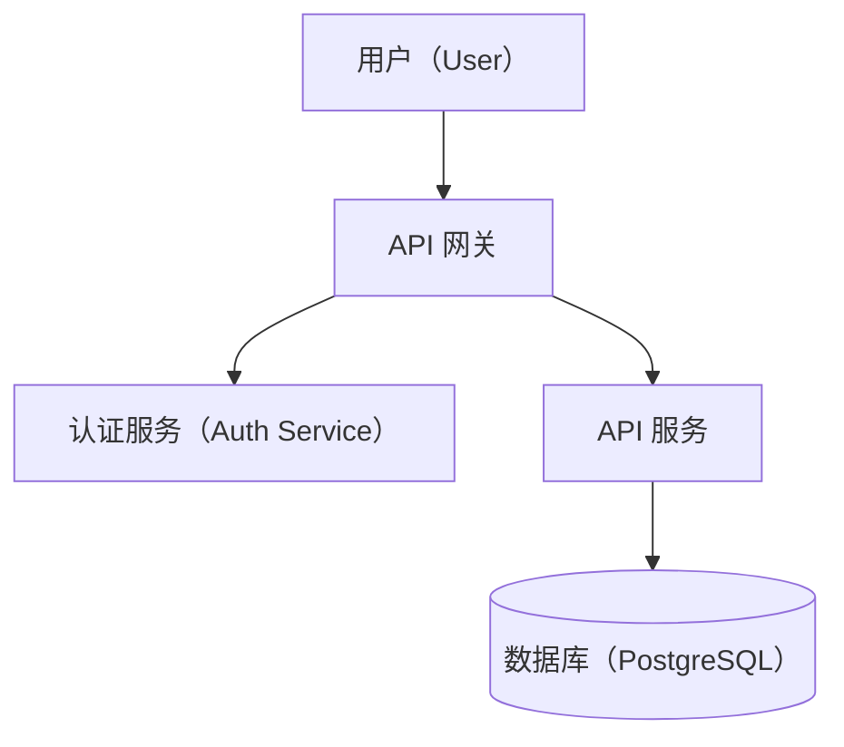
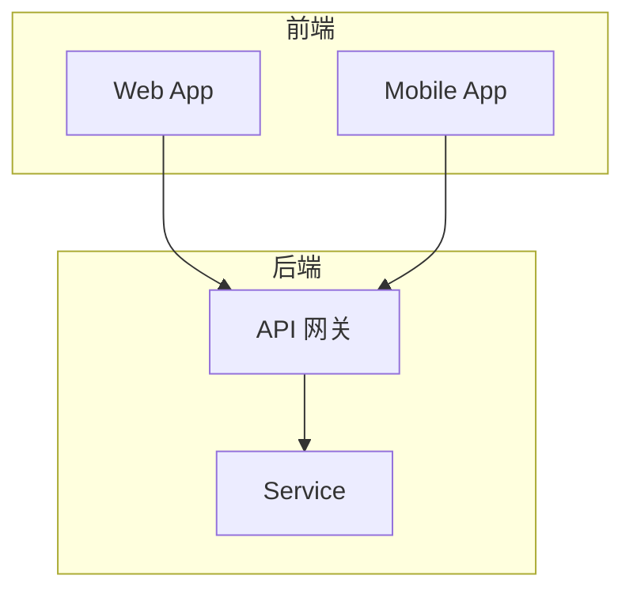

# Mermaid Diagram Conventions for Knowledge Notes

Use these conventions when including architecture diagrams, sequence flows, or state machines in knowledge-distiller notes.

## Principles

- **One diagram = one concept.** If you need labels explaining what the diagram shows, split it.
- **No hardcoded colors.** Obsidian has light and dark themes. Hardcoded `fill:` / `stroke:` / `color:` will look wrong in one of them. Rely on the theme's default Mermaid rendering — it works in both modes automatically.
- **Prefer `flowchart` over `graph`** for better layout control.
- **Use `subgraph` blocks** to group related components in architecture diagrams.
- **Distinguish node types by shape** (rectangle vs rounded vs cylinder for database vs diamond for decision), not by color.

## Label Convention

Labels follow the note body's terminology rules (§1 of SKILL.md): gloss `中文（English）` on first mention when Chinese is what people say (branch 2), or use the English term as-is when that's the common usage (branch 3 — `API`, `RAG`). Wikilinks (branch 1) don't apply inside a diagram, so diagrams use branches 2/3 only. Do not use emoji — labels are technical identifiers, not icons.

## Architecture Diagrams

Use `subgraph` to group layers or bounded contexts:

## Anti-patterns

| Don't | Why |
|---|---|
| Emoji in labels (`👤 用户`, `🔐 认证服务`) | Renders inconsistently across platforms. Unprofessional in a reference note. |
| Hardcoded colors (`fill:#90EE90,color:darkgreen`) | Breaks in dark mode. Theme default handles both modes. |
| One diagram explaining multiple concepts | Reader can't parse it at a glance — defeats the purpose. |
