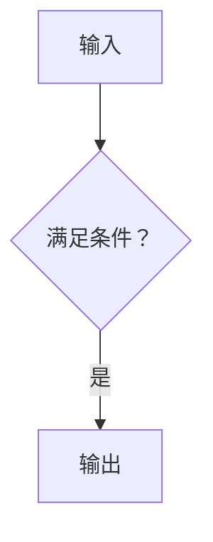

# Mermaid reference

Use Mermaid only when it compresses an important relationship. If two or three sentences are clearer, use prose.

## Choose one question

| Reader question | Type |
| --- | --- |
| What flows through the system or decision? | `flowchart` |
| Who calls whom and in what order? | `sequenceDiagram` |
| What states and transitions exist? | `stateDiagram-v2` |
| What types or entities relate? | `classDiagram` or `erDiagram` |
| What changed over time? | `timeline` |

Other types are allowed only when the question genuinely needs them. The checker proves syntax safety, not renderer
compatibility or diagram quality.

## Safe syntax

```markdown

```

- Use stable ASCII IDs; put Chinese punctuation and long text in quoted labels.
- Keep edges short and explain complex relationships beside the diagram.
- Do not use `click`, callbacks, JavaScript, external URLs, raw HTML, `%%{init...}%%`, or body `config:`.
- Quote lowercase `end` when it is a node or label; structural `end` remains valid where Mermaid requires it.
- Do not make color the only carrier of meaning.
- Define terms in nearby prose; do not put raw `[[wikilink]]` syntax in labels.

## Delivery

Every diagram gets one nearby sentence explaining what to inspect and one boundary sentence when the diagram omits
important detail. If the target Obsidian renderer was not opened, mark `Mermaid 渲染未验证` and retain an equivalent
prose explanation.
