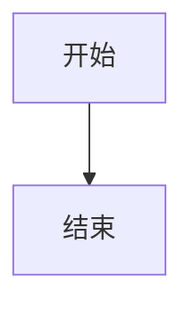
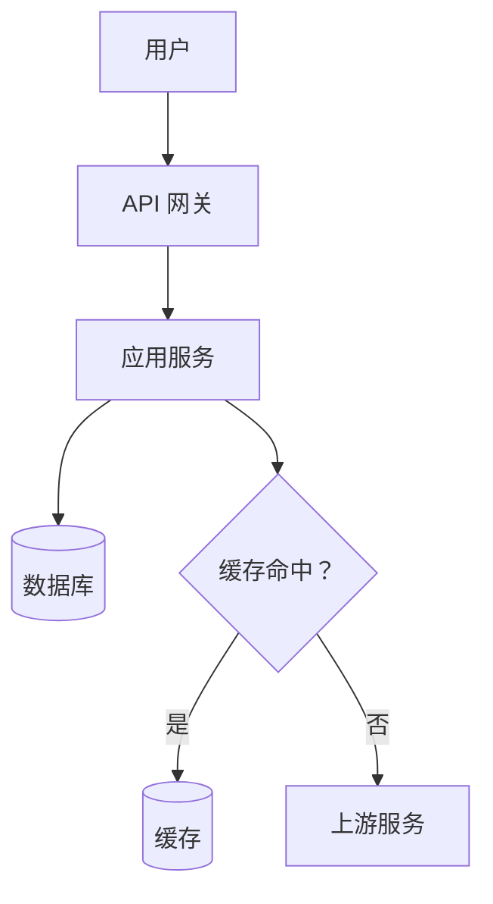
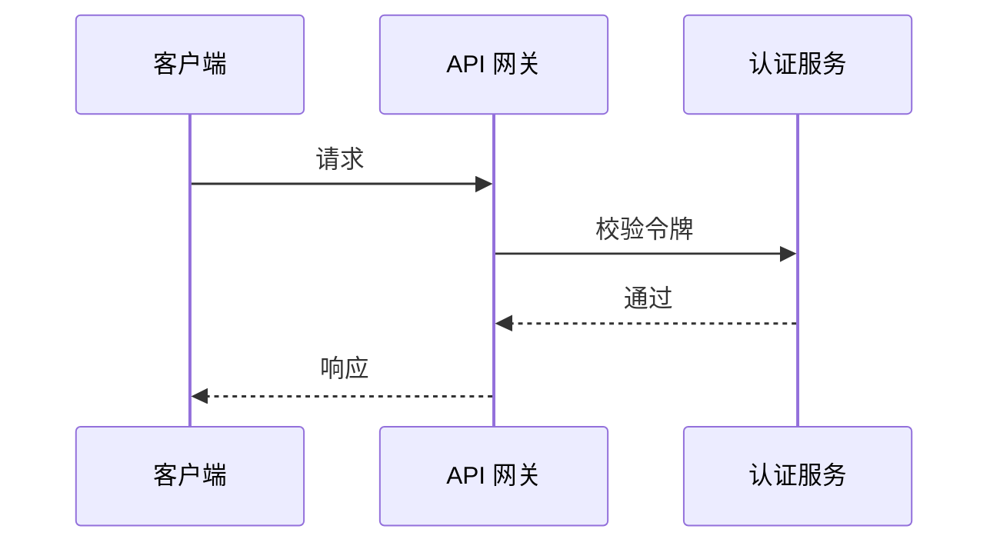
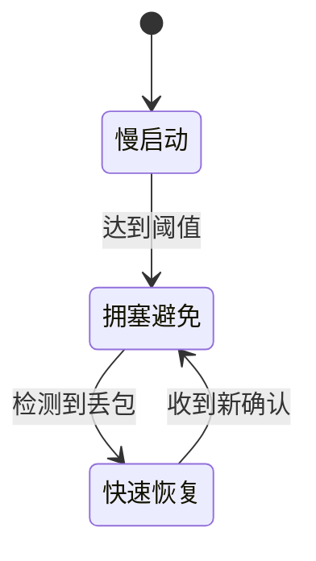

# Mermaid Reference for Knowledge Notes

本文件负责 Mermaid 的教学取舍、语法约束和渲染 fallback；`check-note-surface.ts` 只机械拦截基本类型、危险指令和明显的保留字风险，不能证明图的因果关系正确或已经渲染成功。

Read this reference only when a diagram materially improves the note. A diagram is a compressed explanation,
not a decoration or a requirement to satisfy. If the same relationship is clearer in two short sentences, skip
the diagram.

## 1. Choose the diagram by the question

| Question the reader needs answered | Diagram |
| --- | --- |
| What components, layers, or data paths exist? | `flowchart` |
| What happens first, next, and in response to what? | `sequenceDiagram` |
| What states exist and what causes transitions? | `stateDiagram-v2` |

Prefer one primary question per diagram. A diagram may combine inseparable boundaries and flows when that makes
the system easier to understand. Split it when unrelated concerns, crossings, or detail density make the reader
lose the main relationship. Use `TB` for a top-down hierarchy, `LR` for a left-to-right pipeline, and whichever
direction keeps the smallest useful diagram readable.

## 2. Keep syntax and labels safe

Use a fenced block with the correct diagram type:

````markdown

````

Rules:

- Use stable ASCII identifiers for nodes (`Gateway`, `DB`, `Decision`); put Chinese and punctuation in quoted
  display labels (`Gateway["API 网关"]`).
- Quote labels containing punctuation, brackets, parentheses, question marks, colons, or arrows. This keeps
  prose separate from Mermaid syntax and reduces parser ambiguity.
- Do not use `end` as an unquoted node ID or label. Mermaid treats it specially in flowcharts; use a different
  identifier or quote/capitalize the label.
- Avoid an unspaced lowercase `o` or `x` immediately after a flowchart connector; Mermaid can interpret those
  forms as circle or cross edges. Add a space or capitalize the character when that text is intentional.
- Keep edge labels short. If an edge needs a paragraph of explanation, move that explanation into prose.
- Prefer basic nodes, edges, subgraphs, participants, and state transitions. Avoid experimental syntax when a
  simpler construct conveys the same relationship.
- Keep diagrams static in ordinary knowledge notes: do not use `click`, callbacks, external URLs, raw HTML,
  `%%{init}%%`, `config` directives, or embedded JavaScript. These features make the note dependent on renderer
  settings and can turn content into an interaction surface.
- Do not use emoji. Do not rely on color alone. Omit custom colors and CSS by default; if a local convention
  requires them, verify contrast in both light and dark reading views and preserve the same distinction with
  labels or shapes.
- Define and link concepts in the surrounding prose. Do not put raw `[[wikilink]]` text inside a label. If a
  diagram genuinely needs in-graph navigation, use Obsidian's `class NodeId internal-link;` convention only in
  a `flowchart`, only after verifying the target Obsidian renderer's node-to-note mapping, and only when the node
  ID resolves to the intended note. Do not use this convention in `sequenceDiagram` or `stateDiagram-v2`; use a
  normal Markdown wikilink in the surrounding prose instead. If the mapping is uncertain, omit the in-graph
  link. This is an advanced navigation exception, not the definition mechanism.

Node shape communicates role in a flowchart:

- rectangle `A["..."]` — process, service, or ordinary step;
- cylinder `DB[("...")]` — database or persistent storage;
- diamond `D{"..."}` — decision;
- `subgraph` — a boundary or grouping, not a component.

Do not assign a shape merely for visual variety. If role does not matter, use the rectangle.

## 3. Keep terminology readable

The surrounding prose owns definitions. Introduce or link the important term before the diagram, then use the
same short label in the diagram. Do not turn a node into a glossary entry by putting a long bilingual definition
inside it. Preserve conventional English names such as `API`, `RAG`, and `LLM` when that is how engineers write
them.

The diagram should be understandable without color. Its nodes, arrows, edge labels, and grouping must carry the
meaning on their own.

## 4. Preflight before delivery

Check every diagram:

- [ ] It answers one concrete structural or temporal question.
- [ ] Removing it would make the explanation less clear or materially longer.
- [ ] The diagram type matches the question.
- [ ] Node IDs are stable and simple; display labels are quoted where needed.
- [ ] There is no unquoted `end`, accidental reserved syntax, emoji, or theme-specific style; color is not the
  sole encoding and any custom colors passed the both-theme check.
- [ ] There is no `click`, callback, external URL, raw HTML, `%%{init}%%`, `config`, or embedded JavaScript.
- [ ] Shape semantics are consistent and edge labels are short.
- [ ] Important terms are defined or linked in nearby prose, not hidden in the diagram.
- [ ] It is small enough to scan; split it if the reader must trace too many crossings or unrelated branches.
- [ ] A Mermaid parser or Obsidian reading view was used when available. If no renderer is available, report
  `Mermaid 渲染未验证` in Phase 8 and keep a one-sentence textual explanation in the note.

Obsidian bundles its own Mermaid version. Prefer the basic syntax in this reference rather than assuming that the
latest Mermaid documentation and the installed Obsidian renderer support the same features. If a feature-specific
syntax is necessary, check the target renderer and consult the relevant official page for [flowcharts](https://mermaid.js.org/syntax/flowchart.html),
[sequence diagrams](https://mermaid.js.org/syntax/sequenceDiagram.html), or [state diagrams](https://mermaid.js.org/syntax/stateDiagram.html).

Every diagram needs a one-sentence textual explanation in nearby prose. For a complex diagram, also add Mermaid's
`accTitle` and `accDescr` when the target renderer supports them. The prose is the fallback for readers who cannot
see or render the diagram.

## 5. Safe examples

### Flowchart — architecture or data flow

````markdown

````

### Sequence diagram — interaction order

````markdown

````

### State diagram — state transitions

````markdown

````
